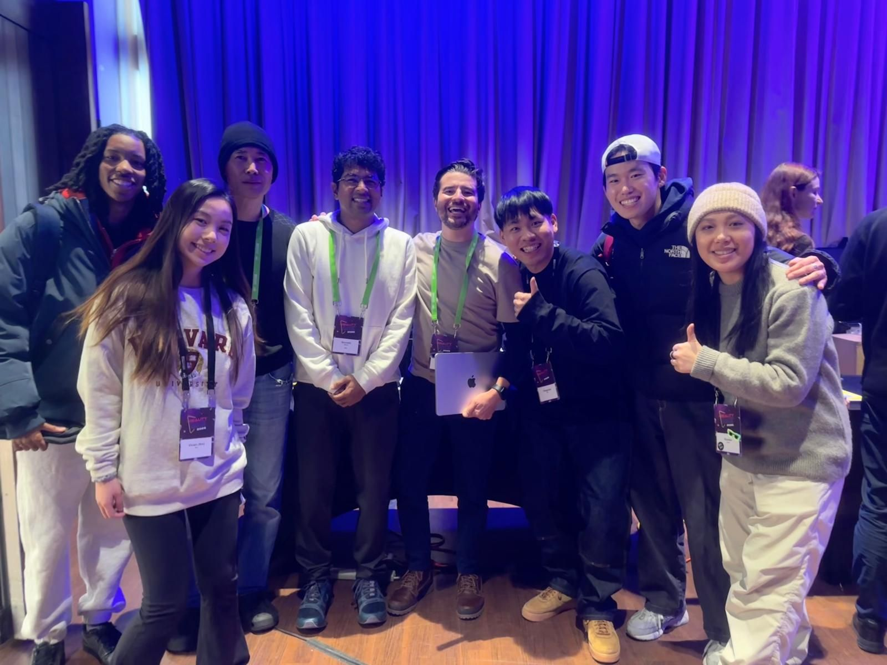
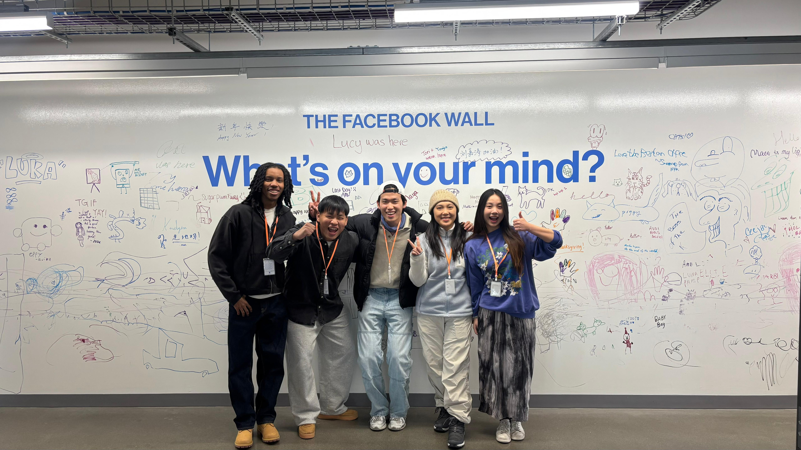

  <h1>SmartSight: You Learn. We Coach.</h1>
  
  

    
  

  
  
 <b>Hands-free AI Study Coaching Service using Meta Ray-Ban Smart Glasses</b> 

 

 

  <a href="https://youtu.be/PbS7iEWzLyw?si=vtYj21MkKTWro6t1">📺 Demo Video (YouTube)</a> 
  &nbsp; | &nbsp;
  <a href="#">📱 iOS App Store (Coming Soon)</a>

---

## Achievements

- **MIT Reality Hack 2026 - Grand Prize (Gold Award) Winner**
- **MIT Reality Hack 2026 - Meta Track Winner**
- **Scheduled to attend AWE USA 2026** (World's #1 XR + AI Event)

  

---

## Project Overview
- **Goal:** To eliminate the hassle of manual study logging and develop an AI coach that automatically analyzes and provide personalized guided study coaching using the 1st-person perspective (POV) of Meta Ray-Ban glasses and a companion app.
- **Core Value:** Visualizing the learning journey without ever interrupting learning itself, transforming fragmented study habits into a unified, actionable "study story" that delivers personalized post-session coaching that tells students not just what they covered, but also what to do next. 
.

---

## Inspiration & Problem Statement

### **Limitations of Traditional Study Tracking**
* **Manual Logging Hassle:** Requirements for manual logging (starting timers, selecting subjects) break the flow and cause distractions.
* **Lacks Contextual Data:** Simply measuring 'study time' lacks the contextual feedback needed to understand what was actually covered.
* **Low Output vs. Input:** A lack of feedback loops means the energy spent on logging doesn't effectively lead to improved learning efficiency.

### **SmartSight’s Solution**
* **Hands-free Tracking:** Meta Ray-Ban cameras and microphones quietly observe and automatically log study sessions as they happen.
* **Contextual Insight:** AI analyzes 1st-person POV images to identify study content, engagement levels, and distractions (like phone usage).
* **Customized AI Pipeline:** Primary data is further processed via our customized AI Pipeline for providing coaching items such as flashcards and quizzes. 
---

## Key Features

### **1. Hands-Free Automatic Logging**
* Automatically tracks study sessions, subjects, and time spent without needing to touch a phone.
* AI automatically tags subjects (Biology, Math, etc.) and subtopics from the 1st-person POV images.

### **2. AI-Powered Contextual Analysis**
* **Learning State Analysis:** Determines if the student is actively solving problems or passively reading.
* **Study Telemetry:** Provides consistent, machine-readable metrics on learning quality using structured JSON data.
* **Distraction Monitoring:** Detects distractions, such as central phone visibility, within the user's field of view.

### **3. AI Coach**
* **In-session Voice Support:** If you're "Stuck? Just ask" — receive instant voice-based guidance without breaking focus. Our principle is designed to avoid giving direct answers, instead asking reflective questions to encourage reasoning.
* **Post-session Flashcards & Quizzes:** Glasses capture and AI backend generate flashcards and quizzes automatically without mannual work for distaction-free study coaching. 

### **4. Learning Dashboard**
* Visualizes metrics such as time per topic, active/passive ratios, and help counts via an iOS application.

---

## Tech Stack

| Category | Tech Stack |
| :--- | :--- |
| **Frontend** | **Swift / SwiftUI** (iOS App), **Xcode** |
| **AI Models** | **GPT-4o (Vision)**, **GPT Realtime API** |
| **Backend** | **Node.js**, **PrismaDB**, **WebSockets** |
| **Infrastructure** | **AWS S3**, HTTP API |
| **Hardware** | **Meta Ray-Ban Smart Glasses** |

---

## Team Members

<table>
  <tr>
    <td align="center">
      <b>Hyunseok Hwang</b> 
       
      Product Engineer
    </td>
    <td align="center">
      <b>Sylvan (Xiaofan) Shen</b> 
       
      Product Manager & Glasses UX Designer
    </td>
    <td align="center">
      <b>Vivian Xin Shu</b> 
       
      Product Manager & Designer
    </td>
    <td align="center">
      <b>Jayden DeCambre</b> 
       
      iOS Engineer
    </td>
    <td align="center">
      <b>Dongchan Kim</b> 
       
      Backend Engineer
    </td>
  </tr>
</table>

---

## 📂 Project Deliverables

- [Presentation Pitch Deck (PDF)](https://www.canva.com/design/DAG_XQDLTDo/Ve8QZl2jKriKnRknXeBuMg/view?utm_content=DAG_XQDLTDo&utm_campaign=designshare&utm_medium=link2&utm_source=uniquelinks&utlId=h1b6bd5e0de)
- [Demo Video Link](https://youtu.be/PbS7iEWzLyw?si=vtYj21MkKTWro6t1)

---

  
<i>see you AWE2026</i>

